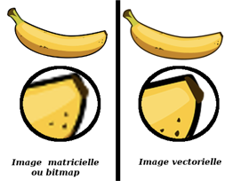

# Exposé sur les formats d'image

## Les formats de fichier d’image

Une image peut être enregistrée sous divers formats. Néanmoins chaque format possède des caractéristiques, avantages et inconvénients, qui les distinguent les uns des autres et les rendent plus ou moins pertinents à utiliser, selon si il s’agit d’une image vectorielle ou matricielle/ bitmap, et ce que l’on souhaite faire de notre image (compression, animation, redimensionner...)

Tout d’abord, 2 types d'images sont utilisés en informatique :

Les images (matricielles) ou bitmap est une image constituée d'un ensemble de points : les pixels. Chaque point porte des informations de position et de couleur. Les photos numériques et les images scannées sont de ce type.
Les formats d'images bitmap sont : **BMP, GIF, JPEG, TIFF, PNG, PSD**, PSP, PCX, FPX , PCX et PCD.

Les images vectorielles sont composées de formes géométriques qui vont pouvoir être décrites d'un point de vue mathématique. Les avantages d'une image vectorielle : les fichiers qui la composent sont petits, les redimensionnements sont faciles sans perte de qualité. Les inconvénients : une image vectorielle ne permet de représenter des formes simples. Elle n'est pas donc utilisable pour la photographie notamment pour obtenir des photos réalistes.

Les formats d’images vectorielles sont : **SVG, AI, PDF**, WMF, CGM, CDR, CMX, DXF, FIF, PCT.

